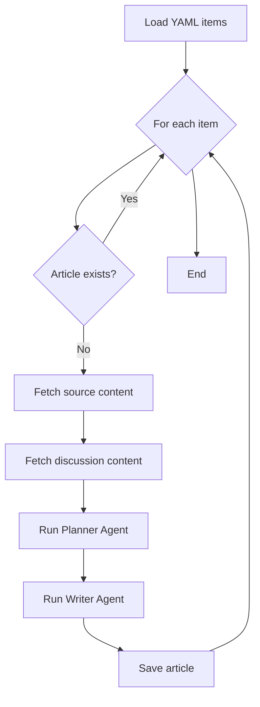

# Article Distillation System

## Workflow



## Input File: `articles.yaml`

```yaml
items:
  - id: 1
    source_url: "https://example.com/article1"
    discussion_url: "https://example.com/discussion1"
  - id: 2
    source_url: "https://example.com/article2"
    discussion_url: "https://example.com/discussion2"
  - id: 3
    source_url: "https://example.com/article3"
    discussion_url: "https://example.com/discussion3"
```

## Agents

### Planner Agent

**Input:** `source_markdown`, `discussion_markdown` (optional)

**Task:** Create a plan for distilling the article.

**Output Format:**

```markdown
# Plan for [Title]

## Key Points

- Point 1
- Point 2
- Point 3

## Structure

1. Introduction
2. Main insight 1
3. Main insight 2
4. Conclusion

## Target: [word count] words, [tone] tone
```

### Writer Agent

**Input:** `source_markdown`, `plan_markdown`, `discussion_markdown` (optional)

**Task:** Write a distilled article following the plan.

**Output Format:**

```markdown
# [Title]

_Source: [link](url)_

## Introduction

[Brief context and value]

## [Section from plan]

[Content with key insights]

## Conclusion

[Main takeaways]
```

## Rules

1. **Citations:** Link to source, don't copy large blocks
2. **Length:** 500-1500 words max
3. **Filename:** `articles/{id}-{slug}.md`
4. **Skip:** If file already exists
5. **Fail gracefully:** Log errors, continue processing

## Example

**Planner Output:**

```markdown
# Plan for React Performance Guide

## Key Points

- Memoization reduces re-renders
- Code splitting improves load times
- Profiling identifies bottlenecks

## Structure

1. Introduction to performance issues
2. Memoization techniques
3. Bundle optimization
4. Measurement tools

## Target: 1200 words, practical tone
```

**Writer Output:**

```markdown
# React Performance: Essential Optimization Techniques

_Source: [Advanced React Patterns](https://example.com/react)_

## Introduction

React apps slow down as they grow. Here are the techniques that make the biggest impact.

## Memoization Techniques

Use React.memo() for expensive components. The key is identifying which components actually benefit...

## Bundle Optimization

Code splitting at route boundaries reduces initial load by 40-60%...

## Conclusion

- Start with React.memo() for expensive renders
- Implement route-based code splitting
- Use React DevTools profiler to measure impact
```
